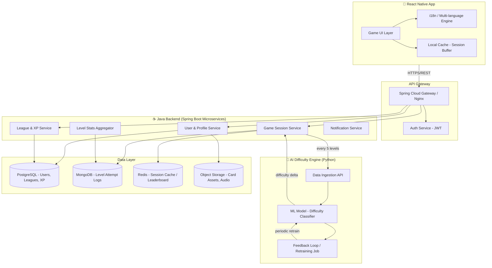
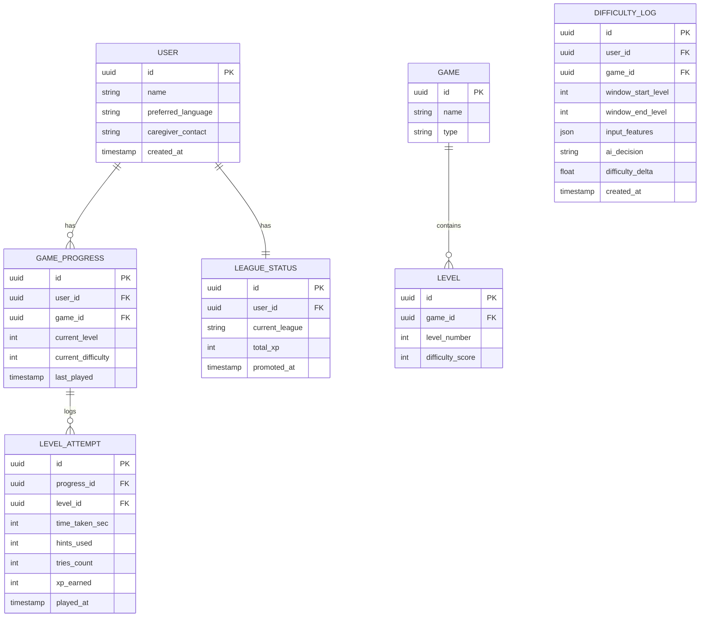
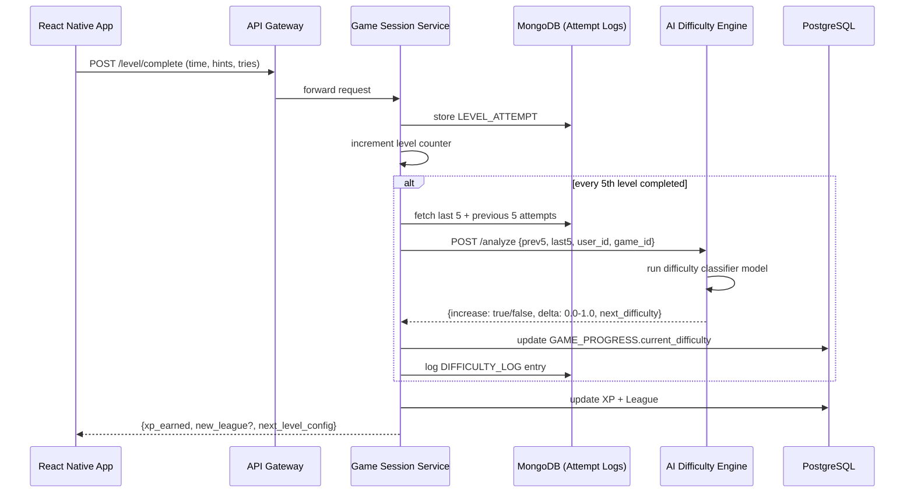
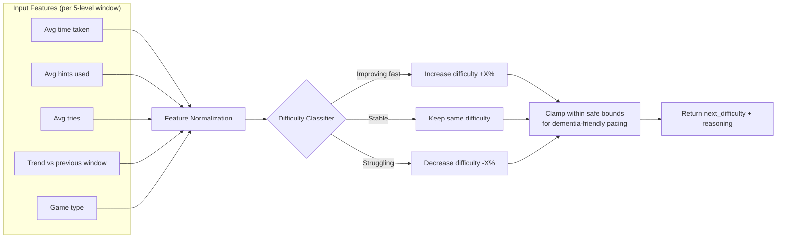
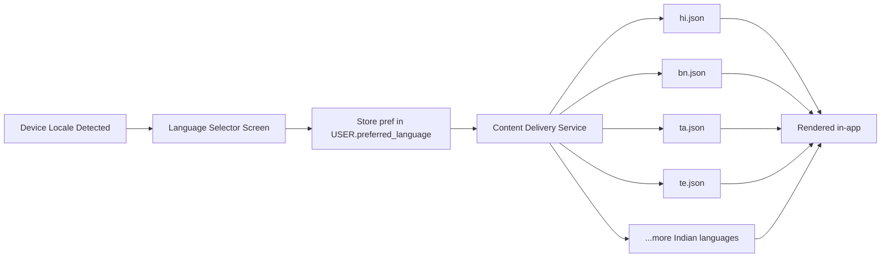
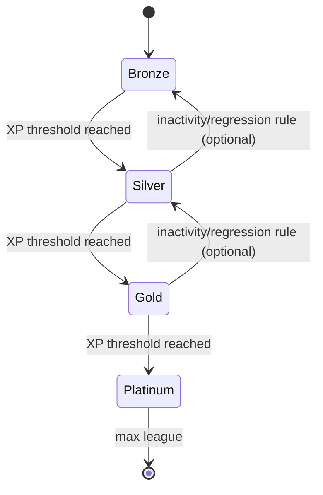

# SmritiSetu — System Design Document

**Mobile Cognitive Care Game for Dementia Patients**
Stack: React Native · Java (Spring Boot) · Python AI Service · PostgreSQL/MongoDB

---

## 1. High-Level Architecture



---

## 2. Core Modules

| Module | Responsibility | Tech |
|---|---|---|
| Auth Service | Login, JWT issue/refresh, patient/caregiver roles | Spring Security + JWT |
| User & Profile Service | Patient profile, language pref, medical notes (optional) | Spring Boot + PostgreSQL |
| Game Session Service | Starts/ends level, records time/hints/tries, requests difficulty | Spring Boot |
| League & XP Service | XP calculation, league promotion/demotion | Spring Boot + PostgreSQL |
| Stats Aggregator | Rolls up last-5 vs previous-5 level windows | Spring Boot + MongoDB aggregation |
| AI Difficulty Engine | Classifies performance trend → difficulty delta | Python (FastAPI) + scikit-learn/XGBoost |
| Notification Service | Reminders, screen-idle hints trigger | FCM |
| i18n Engine | Multi-language content delivery (10+ Indian languages) | react-native-localize + backend content service |

---

## 3. Database Schema (ER Diagram)



---

## 4. Level Attempt → AI Difficulty Flow (Sequence Diagram)



---

## 5. AI Difficulty Engine — Internal Design



**Model approach:** start with a rule-weighted scoring model (explainable, safe for medical-adjacent use), log every decision + outcome into `DIFFICULTY_LOG`, then later train a supervised model (XGBoost/LightGBM) on accumulated logs to replace/augment the rules. Keep decisions bounded (never spike difficulty for cognitively vulnerable users) and always log the "why" for caregiver/clinician transparency.

---

## 6. Game Module Breakdown

```mermaid
graph TD
    subgraph G1["Game 1: Memory Match"]
        G1a[Show N cards for T seconds]
        G1b[Hide cards]
        G1c[Ask: which card/pattern was where?]
        G1d[6-option multiple choice]
        G1a-->G1b-->G1c-->G1d
    end

    subgraph G2["Game 2: Sequence Recall"]
        G2a[Display number/pattern series]
        G2b[User taps numbers in same sequence]
        G2c[Difficulty = series length + complexity]
        G2a-->G2b-->G2c
    end

    subgraph G3["Game 3: Daily Reasoning"]
        G3a[Show situational question]
        G3b[Present 3-4 options]
        G3c[User selects best answer]
        G3a-->G3b-->G3c
    end
```



---

## 7. Multi-Language Support Design



Content (question text, hint text, option labels) stored as versioned JSON bundles per language, served via a lightweight content endpoint so new languages/games don't need app releases.

---

## 8. XP & League System



XP formula (example): `xp = base_xp - (hints_used * hint_penalty) - (tries_count * try_penalty) + speed_bonus`

---

## 9. API Endpoints (Summary)

| Endpoint | Method | Service | Purpose |
|---|---|---|---|
| `/auth/login` | POST | Auth | Login patient/caregiver |
| `/user/profile` | GET/PUT | User Service | Get/update profile & language |
| `/game/{gameId}/level/{n}/start` | GET | Game Session | Fetch level config at current difficulty |
| `/game/{gameId}/level/complete` | POST | Game Session | Submit time, hints, tries |
| `/ai/analyze` | POST | AI Engine | Internal — analyze 5+5 window |
| `/league/status` | GET | League Service | Current league, XP, progress |
| `/content/{lang}/{gameId}` | GET | Content Service | Localized game content |

---

## 10. Non-Functional Requirements

- **Accessibility-first UI:** large tap targets, high contrast, minimal text, audio cues (dementia-friendly UX).
- **Offline resilience:** local buffering of level attempts if network drops, sync on reconnect.
- **Bounded AI decisions:** difficulty never jumps more than a safe delta per adjustment window.
- **Data privacy:** patient data encrypted at rest (AES-256) and in transit (TLS); caregiver consent flow for any data collection.
- **Low cognitive load:** no unnecessary animations/timers that induce stress.
- **Scalability:** stateless Java services behind gateway, horizontally scalable; MongoDB for high-write attempt logs, PostgreSQL for relational league/user data.

---

## 11. Suggested Repo/Module Structure

```
smritisetu/
├── mobile-app/              # React Native
│   ├── src/screens/
│   ├── src/games/
│   ├── src/i18n/
│   └── src/services/api/
├── backend/
│   ├── gateway/
│   ├── auth-service/
│   ├── user-service/
│   ├── game-session-service/
│   ├── league-service/
│   └── content-service/
└── ai-engine/
    ├── app/ (FastAPI)
    ├── models/
    ├── training/
    └── logs/
```
