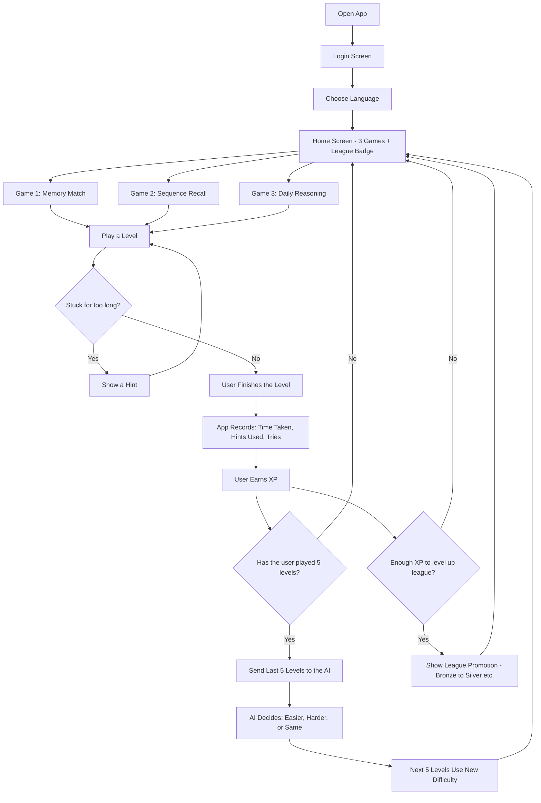
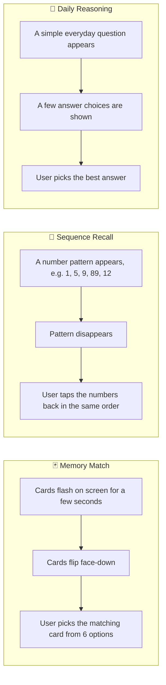
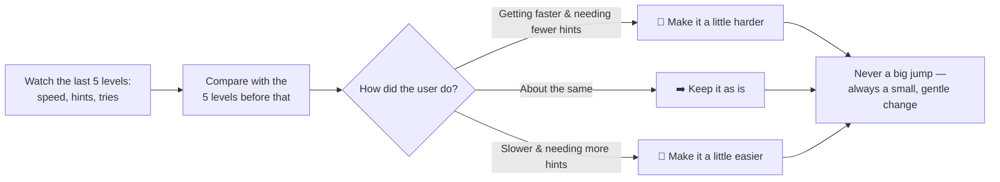
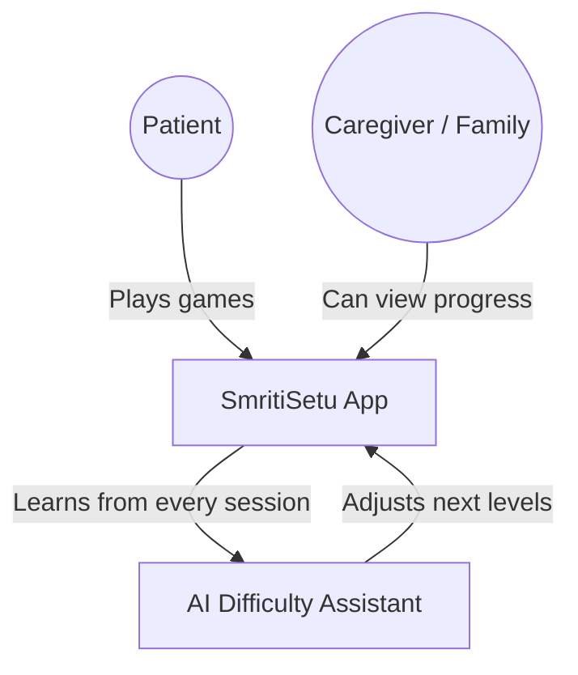
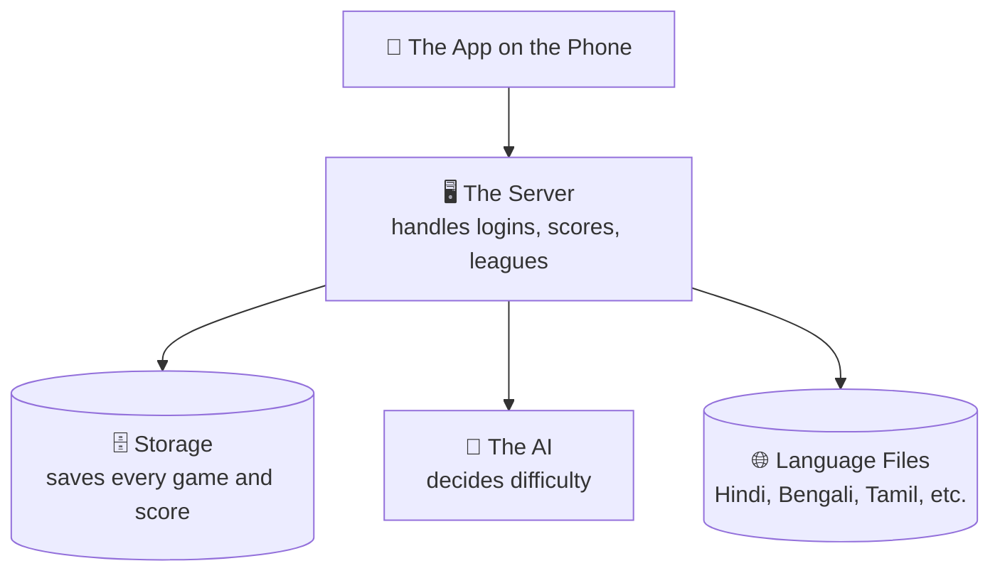

# SmritiSetu — How the App Works

**A simple guide to what SmritiSetu is, how it flows, and how it's built — written so anyone can follow, not just developers.**

---

## 1. What is SmritiSetu?

SmritiSetu is a mobile app with brain games for dementia patients. It plays like a friendly game app — but behind the scenes, it quietly watches how well the patient is doing and adjusts the game's difficulty so it's never too easy (boring) or too hard (frustrating).

Think of it like a smart tutor that's always paying attention and gently adjusting the lesson.

---

## 2. App Flow — What the User Actually Sees

**In plain words:**
1. User logs in and picks their preferred language.
2. They land on a home screen showing 3 games and their current league.
3. They pick a game and play a level.
4. If they're stuck, the screen offers a hint after a short idle period.
5. When they finish, the app quietly notes how long it took, how many hints they used, and how many tries it took.
6. They earn XP (experience points) for finishing — enough XP moves them up a league (like a badge of progress).
7. Every 5 levels, the app looks back at how the last 5 levels went compared to the 5 before that, and decides whether to make the next 5 levels a bit easier, a bit harder, or keep them the same.

---

## 3. The Three Games (Explained Simply)

---

## 4. How the "Smart Difficulty" Works

No complicated math needed to understand this — just three steps:

This keeps the game feeling encouraging rather than stressful — a core requirement for anyone dealing with memory difficulties.

---

## 5. Who's Involved (People & Roles)

- **Patient** — the person playing the games.
- **Caregiver/Family** — can check in on progress (how many levels, how the difficulty has changed over time).
- **AI Assistant** — works quietly in the background, never shown directly to the patient.

---

## 6. The Building Blocks (For Reference)

For anyone curious what powers the app under the hood — this is a simplified map, not the full technical blueprint.

| Part | What it does, in plain terms |
|---|---|
| The App | What the patient sees and taps on their phone |
| The Server | The "traffic controller" — handles logins, saves scores, manages leagues |
| Storage | Where every game result is safely saved |
| The AI | Quietly reviews performance and adjusts difficulty |
| Language Files | Makes sure the app can speak the user's preferred language |

---

## 7. Things We're Careful About

- **Gentle, not stressful** — difficulty never jumps suddenly; changes are always small.
- **Multiple Indian languages** — so language is never a barrier to playing.
- **Privacy** — patient data is kept secure and only shared with caregivers who are meant to see it.
- **Works even with a shaky internet connection** — the app saves progress locally and syncs when it reconnects.

---

*For the full technical architecture (databases, APIs, service breakdown), see the developer-facing system design document.*